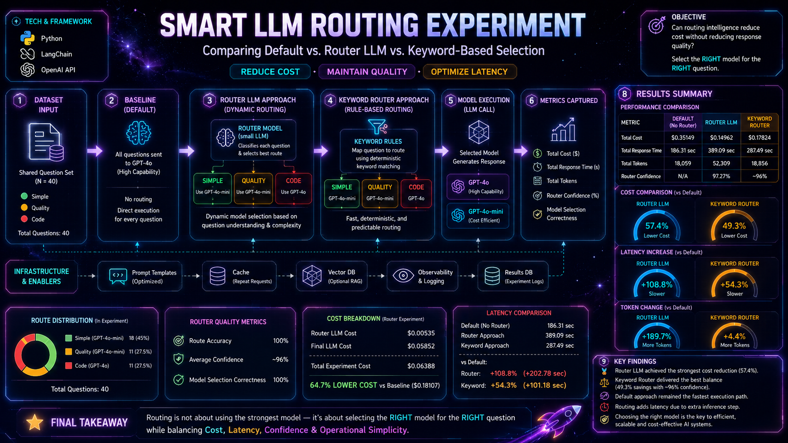

# 🧠 Self-Ask Prompting Experiment: Does Step-by-Step Reasoning Improve Response Quality?

## 📌 Overview

Prompting style can significantly influence how an LLM reasons through complex questions.

In this experiment, I explored whether **Self-Ask Prompting** — a technique where the model first breaks a question into smaller follow-up questions before answering — can improve overall response quality compared to standard prompting.

The goal was to compare:

- **Regular Prompting**
- **Self-Ask Prompting**

using the same question set and evaluate results across:

- Relevance  
- Clarity  
- Completeness  
- Usefulness  

---

## 🎯 Objective

To understand whether structured prompt decomposition improves:

- Answer depth  
- Logical reasoning  
- Completeness of response  
- Overall usefulness  

---

## 🧠 What is Self-Ask Prompting?

Self-Ask prompting encourages the model to:

1. Interpret the main question  
2. Generate intermediate sub-questions  
3. Solve smaller reasoning steps  
4. Synthesize a final answer  

### Example:

**Question:**  
“What are the long-term effects of EV adoption?”

**Self-Ask Style:**  
- What impacts oil demand?  
- How does EV adoption affect battery supply chains?  
- What are environmental implications?  

👉 Final answer becomes more structured and comprehensive.

---

## ⚙️ Tech Stack

- OpenAI  
- LangChain  
- Python  
- CSV Logging / Evaluation  

---

## 🧠 Architecture Diagram

  

---

## 🧪 Experiment Design

### Standard Prompting
- Direct question → Direct answer  

### Self-Ask Prompting
- Direct question → Follow-up reasoning → Final answer  

Both methods were tested using the same evaluation dataset for fair comparison.

---

## 📊 Key Evaluation Focus

### 🔹 Relevance
Does the answer address the actual question?

### 🔹 Clarity
Is the answer understandable and well-structured?

### 🔹 Completeness
Does it cover all major aspects?

### 🔹 Usefulness
Is it actionable or insightful?

---

## 🔍 Expected Insights

This experiment is designed to reveal:

- Does Self-Ask improve reasoning depth?  
- Does it increase completeness?  
- Does it trade speed or token cost for quality?  
- Which prompt style works better for complex questions?  

---

## 💡 Why This Matters

In real-world GenAI systems, prompt design is architecture.

The difference between:
- A direct answer  
vs  
- A decomposed reasoning process  

can significantly impact response quality.

This becomes especially relevant for:

- Research assistants  
- Agentic workflows  
- Multi-step reasoning systems  
- Educational AI  

---

## 🚀 Potential Trade-Offs

### Self-Ask Advantages:
- Better structured reasoning  
- Improved completeness  
- More transparent logic  

### Possible Costs:
- Higher token usage  
- Longer latency  
- Increased API cost  

---

## 📎 Repo

https://github.com/TechTrojan/GenAI/tree/Prompt_Self_Ask

---

## 🎯 Final Thought

This experiment isn’t just about asking better questions.

It’s about understanding whether **how we ask** can fundamentally improve **how AI thinks**.

👉 Sometimes better answers may come not from a better model…  
but from a better reasoning process.
